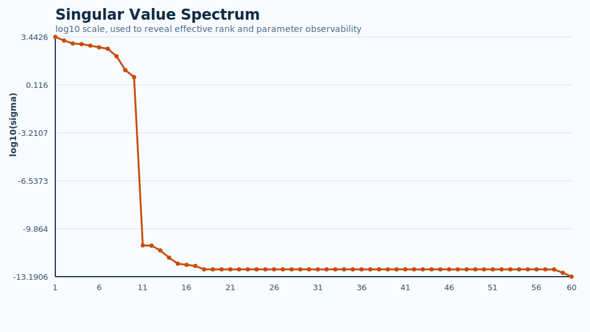
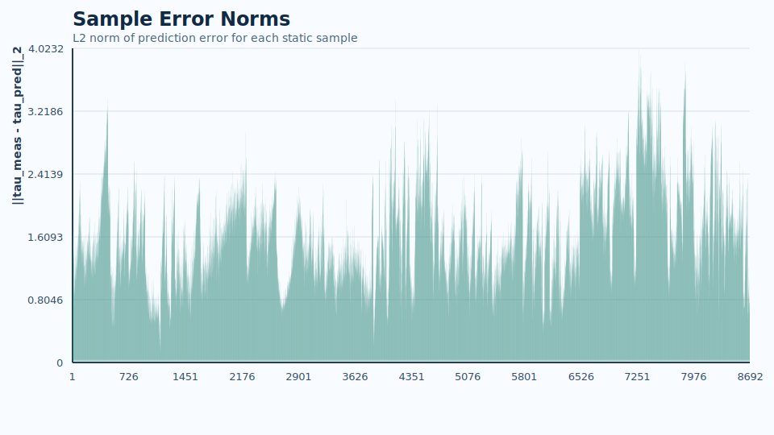
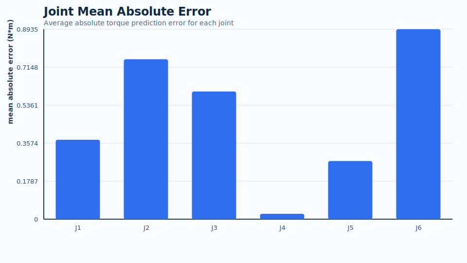

# 机械臂静态重力补偿参数辨识


https://github.com/user-attachments/assets/c9535d9c-64fe-4645-a2d3-28b1a365da3c


## 1. 实现思路

项目目标：实现机械臂在静态工况下的重力参数辨识，并据此实现关节空间的重力补偿前馈。

机械臂的标准关节空间动力学可以写成：

$$
M(q)\ddot{q} + C(q,\dot{q})\dot{q} + g(q) = \tau + \tau_{ext}
$$

其中：

- $M(q)$ 是惯性矩阵
- $C(q,\dot{q})\dot{q}$ 是科氏力 / 离心力项
- $g(q)$ 是重力项
- $\tau$ 是关节驱动力矩
- $\tau_{ext}$ 是外部扰动或外力等效到关节空间后的力矩

本项目当前只聚焦于**静态重力辨识**。
因此在静止工况下令速度和加速度为零，并忽略外部扰动，仅保留重力项：

$$
\dot{q} = 0,\qquad \ddot{q} = 0,\qquad \tau_{ext} = 0
$$

此时动力学方程退化为：

$$
\tau_g(q) = g(q)
$$

在 Pinocchio 中，重力项对动力学参数是线性的，因此可以写成：

$$
\tau_g(q) = Y_g(q)\,\pi
$$

其中：

- $\tau_g(q)$ 为当前姿态下的重力补偿力矩，也就是力矩观测向量
- $Y_g(q)$ 为重力回归矩阵
- $\pi$ 为动力学参数向量，也就是待辨识参数

整个静态重力辨识流程如下。

### 1.1 建立刚体动力学模型

利用 URDF 和 Pinocchio 建立机械臂刚体动力学模型。

### 1.2 构造 Pinocchio 状态量

将机械臂的物理关节角 `theta` 转换为 Pinocchio 需要的广义坐标 `q`。

### 1.3 构造静态样本

通过实验采集多组静态样本，每组样本包含：

- 关节角 `theta`
- 对应的关节力矩 `tau`

### 1.4 堆叠最小二乘问题

将所有样本堆叠为最小二乘问题：

$$
A\pi = b
$$

其中：

- $A$ 为所有静态样本对应的回归矩阵堆叠结果
- $b$ 为所有静态样本对应的力矩观测向量堆叠结果

### 1.5 提取可辨识基参数

由于静态重力辨识通常无法唯一确定全部原始动力学参数，因此对回归矩阵 $A$ 做 SVD 分解，提取可辨识基参数空间：

$$
\pi = V_{base}\alpha
$$

代入后可得到降维后的辨识问题：

$$
A_{base}\alpha = b
$$

### 1.6 最小二乘辨识

通过最小二乘求得基参数 $\hat{\alpha}$，再重构得到一组等价的参数向量 $\hat{\pi}$：

$$
\hat{\pi} = V_{base}\hat{\alpha}
$$

### 1.7 重力补偿预测

最终利用辨识结果预测任意姿态下的重力补偿力矩：

$$
\tau_{pred}(q) = Y_g(q)\hat{\pi}
$$

说明：

- 本项目当前只处理静态重力辨识
- 不涉及完整动态工况下的科里奥利项和惯量项辨识
- 第 1.5 到第 1.7 步的具体数学推导可参考 [docs/svd_base_parameter_identification.md](docs/svd_base_parameter_identification.md)

### 1.8 真机数据采集与准静态样本构造

`gravity_samples_demo.csv` 只能验证辨识流程能否跑通，不能直接代表真机。
因此在实际部署前，需要先从下位机实时采集真机关节空间数据：

- 关节角 `theta1 ~ theta6`
- 关节力矩 `tau1 ~ tau6`

本项目中，上位机通过 [launch/collect_serial_raw.py](launch/collect_serial_raw.py) 完成：

1. 串口原始二进制帧接收；
2. 原始 CSV 保存；
3. 根据 `qdot` 阈值筛出准静态样本；
4. 生成可直接用于辨识和拟合的 `mc02_capture_cleaned.csv`。

这样做的目的，是尽量让输入样本更接近：

$$
\dot q \approx 0,\qquad \ddot q \approx 0
$$

从而降低动态项、跟踪误差和速度项对重力拟合的污染。

### 1.9 三角基函数拟合思路

`run_identification.py` 的任务，是验证 URDF + Pinocchio 的重力模型是否能大致解释真机数据；
而真正面向 MCU 部署的，是 [launch/fit_trig_gravity_model.py](launch/fit_trig_gravity_model.py)。

这一步不再直接部署完整刚体模型，而是对每个关节建立一个低计算量的近似函数：

$$
\tau_j(q) \approx \sum_k c_{j,k}\,\phi_{j,k}(q)
$$

其中：

- $q$ 为当前关节空间姿态；
- $\tau_j(q)$ 为第 $j$ 个关节在该姿态下的重力补偿力矩；
- $\phi_{j,k}(q)$ 为人为选取的三角基函数；
- $c_{j,k}$ 为待拟合系数。

这里使用三角基函数，是因为串联机械臂的重力矩天然和累计关节角的正弦余弦项有关。
例如对近端关节，常见的项包括：

$$
\sin(q_2),\quad \cos(q_2),\quad
\sin(q_2+q_3),\quad \cos(q_2+q_3),\quad
\sin(q_2+q_3+q_4),\quad \cos(q_2+q_3+q_4)
$$

将所有样本堆叠后，可以写成标准线性最小二乘问题：

$$
y \approx \Phi c
$$

其中：

- $y$ 为某个关节所有样本的真实力矩标签；
- $\Phi$ 为设计矩阵；
- $c$ 为该关节对应的拟合系数向量。

虽然 `sin` / `cos` 对姿态变量是非线性的，但对于待求系数 $c$ 是线性的，
因此可以直接通过最小二乘求解。

### 1.10 Ridge 正则化与 MCU 轻量化部署

为了避免某些系数被局部脏数据拉得过大，导致 MCU 上出现力矩尖峰，
本项目在普通最小二乘基础上加入 Ridge 正则化：

$$
\min_c \|\Phi c - y\|^2 + \lambda \|c\|^2
$$

这里的 $\lambda$ 用来控制模型的保守程度：

- $\lambda$ 较小，模型更贴数据，但更容易局部过冲；
- $\lambda$ 较大，模型更稳，但可能欠拟合。

这样做的目的不是替代基参数辨识，而是让**最终用于 MCU 部署的轻量函数**更加稳定。

运行 [launch/fit_trig_gravity_model.py](launch/fit_trig_gravity_model.py) 后，会自动导出：

- `gravity_trig_model.h`

该头文件中包含：

- 每个关节拟合得到的系数数组；
- 每个关节对应的 `static inline` 重力补偿函数。

MCU 侧部署时，只需要：

1. 读取当前关节空间角 `q`；
2. 调用导出的 `MecArm_Gravity_Jx(...)`；
3. 得到当前姿态下的轻量化重力补偿力矩：

$$
\tau_{ff}(q)=\hat{\tau}_g(q)
$$

再将其作为前馈项加入控制器：

$$
\tau_{cmd} = \tau_{ctrl} + \tau_{ff}
$$

其中：

- $\tau_{ctrl}$ 为原控制器输出；
- $\tau_{ff}$ 为重力补偿前馈。

因此，本项目中真正用于**实际 MCU 轻量化部署**的部分，不是直接把 Pinocchio 的完整重力模型搬到下位机，
而是将真机数据拟合为一组可在 MCU 上低成本运行的三角基函数模型。

## 2. 库依赖

当前项目使用 Python 版本的 Pinocchio 完成：

- URDF 导入
- 重力力矩计算
- 重力回归矩阵构造
- 基参数辨识验证

同时使用 NumPy / SciPy 完成矩阵运算与最小二乘求解，并使用 `pyserial` 完成真机串口采集。

### 2.1 推荐运行环境

推荐环境如下：

- Windows
- Conda
- Python 3.11

当前项目是在以下环境中开发和验证的：

- Python 3.11
- Pinocchio 3.9.0
- NumPy
- SciPy
- pyserial

### 2.2 第三方依赖

#### 2.2.1 核心数学与建模依赖

| 依赖        | 作用                                          |
| ----------- | --------------------------------------------- |
| `pinocchio` | 导入 URDF、构造刚体模型、计算重力项与回归矩阵 |
| `numpy`     | 数组运算、线性代数、误差统计                  |
| `scipy`     | 部分科学计算与拟合相关支持                    |

#### 2.2.2 采集与通信依赖

| 依赖       | 作用                                             |
| ---------- | ------------------------------------------------ |
| `pyserial` | 从下位机串口实时读取二进制遥测帧，并保存原始 CSV |

#### 2.2.3 Python 标准库依赖

以下模块属于 Python 标准库，无需单独安装：

- `pathlib`
- `math`
- `csv`
- `json`
- `datetime`
- `dataclasses`
- `struct`
- `time`
- `sys`

### 2.3 推荐安装方式

推荐使用 Conda 创建独立虚拟环境：

```powershell
conda create -n mec_arm python=3.11 -y
conda activate mec_arm
conda install pinocchio numpy scipy -c conda-forge --solver libmamba -y
pip install pyserial
```

### 2.4 安装后的检查方式

环境安装完成后，建议先执行以下检查：

```powershell
python -c "import pinocchio as pin; import numpy; import scipy; import serial; print('env ok')"
```

如果终端正常打印：

```text
env ok
```

说明当前 Python 环境已经满足本项目运行要求。

### 2.5 关于 Pinocchio 的说明

需要注意：

- `pip list` 或 Conda 环境中，Pinocchio 相关包名有时会显示为 `pin`
- 在代码中实际导入方式仍然是：

```python
import pinocchio as pin
```

### 2.6 不同脚本对依赖的要求

不同入口脚本依赖并不完全相同。

| 脚本                                                                 | 必要依赖                      |
| -------------------------------------------------------------------- | ----------------------------- |
| [launch/demo_synthetic.py](launch/demo_synthetic.py)                 | `pinocchio`、`numpy`、`scipy` |
| [launch/run_identification.py](launch/run_identification.py)         | `pinocchio`、`numpy`、`scipy` |
| [launch/collect_serial_raw.py](launch/collect_serial_raw.py)         | `pyserial`                    |
| [launch/fit_trig_gravity_model.py](launch/fit_trig_gravity_model.py) | `numpy`                       |

因此：

- 如果你只是先验证辨识链路，至少需要装好 `pinocchio + numpy + scipy`
- 如果你要接真机串口采集，还必须额外安装 `pyserial`

### 2.7 运行前的注意事项

在第一次运行脚本前，还需要确认以下非 Python 依赖条件：

- 已经准备好正确的机械臂 URDF；
- 下位机串口发送协议与 [launch/collect_serial_raw.py](launch/collect_serial_raw.py) 一致；
- 串口号 `PORT` 已按本机实际情况修改；
- 真机发送出的 `theta` 与 `tau` 语义已经和项目中使用的关节空间语义对齐。

如果这些外部条件没有满足，即使 Python 环境正确，辨识结果也不会可靠。

## 3. 文件结构 文件职责

当前项目目录结构如下：

```text
gravity_identification/
├─ csv/
│  └─ mc02_capture_raw.csv
├─ data/
│  ├─ gravity_samples_demo.csv
│  ├─ mc02_capture_cleaned.csv
│  ├─ 20260425_231814/
│  └─ 20260425_235938/
├─ docs/
│  ├─ svd_base_parameter_identification.md
│  └─ trig_gravity_model_math.md
├─ launch/
│  ├─ collect_serial_raw.py
│  ├─ demo_synthetic.py
│  ├─ fit_trig_gravity_model.py
│  └─ run_identification.py
├─ results/
│  ├─ gravity_samples_demo/
│  └─ mc02_capture_cleaned/
│     └─ 时间戳/
│        ├─ data/
│        ├─ export/
│        ├─ figures/
│        └─ report/
├─ src/
│  ├─ base_params.py
│  ├─ csv_dataset.py
│  ├─ dataset.py
│  ├─ gravity.py
│  ├─ identify.py
│  ├─ report_plots.py
│  ├─ report_writer.py
│  ├─ results_io.py
│  └─ urdf_import.py
├─ video/
│  └─ VID_20260426_004041.mp4
└─ README.md
```

### 3.1 根目录与资源目录

| 路径                   | 职责                                                               |
| ---------------------- | ------------------------------------------------------------------ |
| [README.md](README.md) | 项目总说明，介绍辨识思路、真机部署流程、依赖、目录结构和结果展示。 |
| [csv/](csv)            | 保存串口实时采集得到的原始未清洗数据。                             |
| [data/](data)          | 保存可直接用于辨识与拟合的清洗后数据，以及部分历史数据备份。       |
| [docs/](docs)          | 保存该项目的数学推导文档。                                         |
| [launch/](launch)      | 保存可直接运行的入口脚本。                                         |
| [results/](results)    | 保存每次辨识或拟合运行的结果，按数据集名称和时间戳分类。           |
| [src/](src)            | 保存辨识与报告生成所需的核心 Python 模块。                         |
| [video/](video)        | 保存真机演示视频。                                                 |

### 3.2 数据文件

| 文件                                                           | 职责                                                                     |
| -------------------------------------------------------------- | ------------------------------------------------------------------------ |
| [csv/mc02_capture_raw.csv](csv/mc02_capture_raw.csv)           | 串口实时采集得到的原始数据流，包含逐帧的`theta1~theta6` 与 `tau1~tau6`。 |
| [data/gravity_samples_demo.csv](data/gravity_samples_demo.csv) | 示例数据集，用于验证辨识流程能否跑通。                                   |
| [data/mc02_capture_cleaned.csv](data/mc02_capture_cleaned.csv) | 经过`qdot` 阈值清洗后的准静态真机样本，是当前辨识和拟合的主要输入。      |

### 3.3 文档文件

| 文件                                                                                   | 职责                                                                      |
| -------------------------------------------------------------------------------------- | ------------------------------------------------------------------------- |
| [docs/svd_base_parameter_identification.md](docs/svd_base_parameter_identification.md) | 解释为什么要做 SVD / thin SVD 基参数辨识，以及背后的数学原理。            |
| [docs/trig_gravity_model_math.md](docs/trig_gravity_model_math.md)                     | 解释三角基函数拟合、设计矩阵、Ridge 正则化以及导出 MCU 头文件的数学原理。 |

### 3.4 `launch/` 入口脚本

| 文件                                                                 | 职责                                                                                             |
| -------------------------------------------------------------------- | ------------------------------------------------------------------------------------------------ |
| [launch/collect_serial_raw.py](launch/collect_serial_raw.py)         | 从下位机串口实时读取二进制数据帧，写原始 CSV，并按`qdot` 阈值自动清洗出准静态样本。              |
| [launch/demo_synthetic.py](launch/demo_synthetic.py)                 | 使用 URDF 模型构造合成样本，验证“建模 -> 回归矩阵 -> 基参数辨识 -> 预测”的整条链路是否跑通。     |
| [launch/run_identification.py](launch/run_identification.py)         | 物理辨识主入口。负责读取 CSV、构造重力回归矩阵、做基参数辨识、回代预测，并保存图表与报告。       |
| [launch/fit_trig_gravity_model.py](launch/fit_trig_gravity_model.py) | MCU 轻量化部署主入口。负责对真机清洗数据做三角基函数最小二乘拟合，并导出`gravity_trig_model.h`。 |

### 3.5 `src/` 核心模块

| 文件                                         | 职责                                                                          |
| -------------------------------------------- | ----------------------------------------------------------------------------- |
| [src/urdf_import.py](src/urdf_import.py)     | 加载 URDF，构造 Pinocchio 模型与数据对象，并实现`theta -> q` 的状态转换。     |
| [src/gravity.py](src/gravity.py)             | 计算当前姿态下的重力力矩`tau_g(q)`，以及静态辨识所需的重力回归矩阵 `Y_g(q)`。 |
| [src/dataset.py](src/dataset.py)             | 定义单条静态辨识样本`GravitySample` 的统一数据结构。                          |
| [src/csv_dataset.py](src/csv_dataset.py)     | 从 CSV 中读取样本，并转换为`GravitySample` 列表。                             |
| [src/identify.py](src/identify.py)           | 构造整体辨识矩阵`A` 和观测向量 `b`，并提供重力预测接口。                      |
| [src/base_params.py](src/base_params.py)     | 对回归矩阵做 SVD 分析，提取可辨识基参数空间，并完成基参数辨识与参数重构。     |
| [src/results_io.py](src/results_io.py)       | 创建结果目录，并保存 JSON、NPZ、逐样本预测 CSV 等结果文件。                   |
| [src/report_plots.py](src/report_plots.py)   | 生成奇异值谱、样本误差、各关节平均绝对误差等 SVG 图表。                       |
| [src/report_writer.py](src/report_writer.py) | 自动生成 Markdown 报告，便于实验记录、Obsidian 阅读和 GitHub 展示。           |

### 3.6 `results/` 结果目录说明

每次运行都会在 `results/<数据集名称>/<时间戳>/` 下生成独立结果目录，通常包含以下子目录：

| 子目录     | 职责                                                      |
| ---------- | --------------------------------------------------------- |
| `data/`    | 保存本次运行的核心数值结果与逐样本预测结果。              |
| `export/`  | 保存拟合后导出的 MCU 头文件，例如`gravity_trig_model.h`。 |
| `figures/` | 保存自动生成的可视化图表。                                |
| `report/`  | 保存自动生成的 Markdown 报告。                            |

### 3.7 视频资源

| 文件                                                           | 职责                                             |
| -------------------------------------------------------------- | ------------------------------------------------ |
| [video/VID_20260426_004041.mp4](video/VID_20260426_004041.mp4) | 真机实际演示视频，用于展示当前重力补偿部署效果。 |

当前推荐运行方式：

```powershell
conda run -n 虚拟环境名称 python launch/collect_serial_raw.py
conda run -n 虚拟环境名称 python launch/run_identification.py
conda run -n 虚拟环境名称 python launch/fit_trig_gravity_model.py
```

运行完成后，会在 [results](results) 下自动生成完整结果报告和可以用于MCU的C语言头文件

## 4. 可视化结果

以下图片来自run_identification.py调用生成

### 4.1 奇异值谱

该图用于观察回归矩阵的奇异值分布，从而判断有效秩、可辨识维度以及数据激励情况。



### 4.2 样本误差范数

该图展示逐样本预测误差的范数大小，用于观察是否存在局部坏点、限位污染样本或某些姿态区域的失配。



### 4.3 各关节平均绝对误差

该图展示不同关节的平均绝对误差大小，可用于判断当前哪几个关节更适合优先部署到 MCU。


