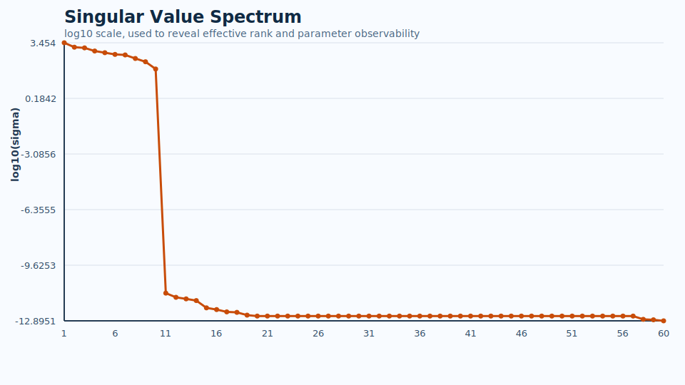
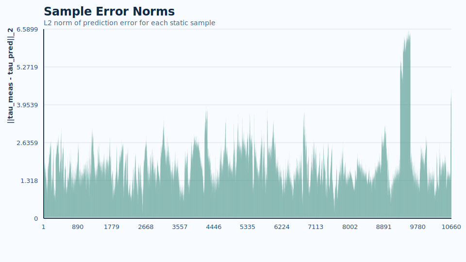
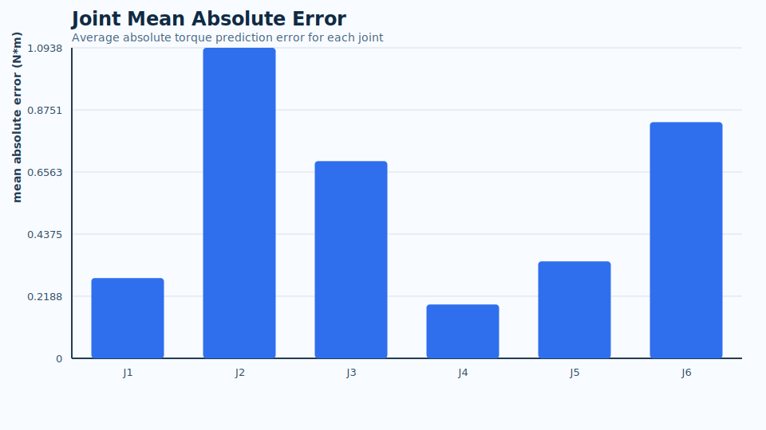

# 机械臂静态重力参数辨识报告

## 1. 项目目标

本次辨识的目标是针对机械臂静态工况建立重力补偿前馈模型。  
方法上采用 Pinocchio 从 URDF 构建刚体动力学模型，并基于静态样本构造重力回归矩阵，进一步通过 SVD 提取可辨识基参数，完成静态重力参数辨识。

## 2. 数据来源

- 输入 CSV: `E:\RoboMaster\mec_arm\gravity_identification\data\mc02_capture_cleaned.csv`
- 样本数量: `10660`

## 3. 矩阵规模与辨识维度

- 原始回归矩阵维度: `(63960, 60)`
- 观测向量维度: `(63960,)`
- 基参数回归矩阵维度: `(63960, 10)`
- 基参数映射矩阵维度: `(60, 10)`
- 原始问题有效秩: `10`
- 基参数问题秩: `10`

## 4. 误差指标

- 平均样本误差范数: `1.868404e+00`
- 最大样本误差范数: `6.589858e+00`

## 5. 结果解读

1. 原始动力学参数在当前静态重力辨识任务下并非全部可辨识，因此需要通过 SVD 提取基参数空间。
2. 回归矩阵的有效秩反映了当前数据条件下真正能够被辨识出的独立参数组合数量。
3. 当前误差指标反映了模型预测力矩与样本观测力矩之间的吻合程度，误差越小说明重力补偿模型越准确。

## 6. 图表结果

### 奇异值谱

### 样本误差范数

### 各关节平均绝对误差

## 7. 结论

当前辨识流程已经完成了从 CSV 数据读取、URDF 建模、重力回归矩阵构建、基参数辨识到误差评估与结果可视化的完整闭环。  
后续若接入真实实验采样数据，可在此框架基础上进一步完成真实机械臂的静态重力补偿参数辨识。
